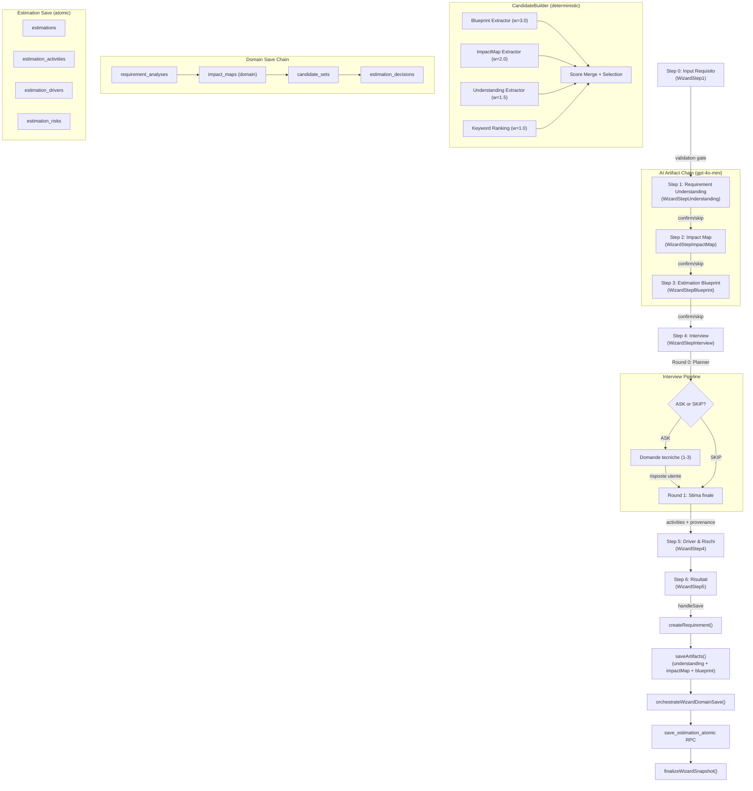
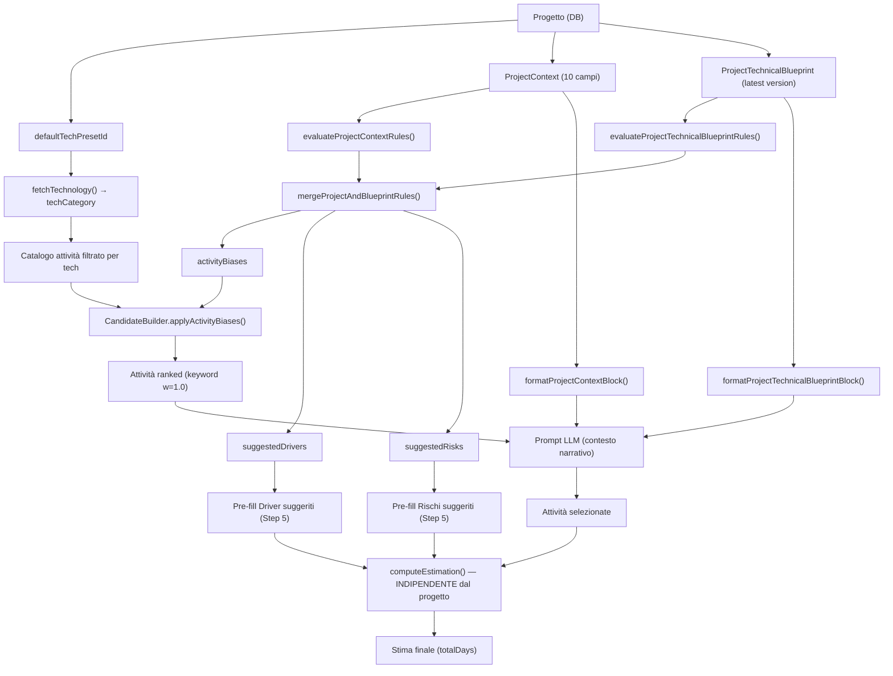

# Analisi Pipeline Wizard — Source of Truth

> **Generato:** 2026-04-05  
> **Metodo:** Analisi sistematica del codice sorgente (il wizard è la source of truth)  
> **Scope:** Pipeline completa end-to-end, dalla raccolta input al salvataggio finale

---

## 1. Executive Summary

La pipeline di stima Syntero è un flusso a **7 step** gestito da `RequirementWizard.tsx`, che orchestra una catena di artifact AI progressivi (Understanding → ImpactMap → Blueprint), seguita da un interview planner con logica ASK/SKIP, selezione deterministica attività, e salvataggio atomico.

Il cuore decisionale è **l'endpoint `ai-estimate-from-interview`**, che combina tutti gli artifact upstream con il `CandidateBuilder` (3 signal extractor: blueprint, impactMap, understanding + keyword fallback) per produrre la selezione attività finale. Il modello AI (`gpt-4o`) riceve candidati pre-ranked e produce la selezione finale vincolata al catalogo.

La persistenza avviene in due fasi: (1) artifact AI nelle tabelle dedicate (`requirement_understanding`, `impact_map`, `estimation_blueprint`), e (2) domain model orchestrato (`requirement_analyses → impact_maps → candidate_sets → estimation_decisions → estimations → estimation_snapshots`). Il salvataggio è atomico via RPC `save_estimation_atomic` per le tabelle estimation, e sequenziale per il domain model.

L'entry point alternativo **Quick Estimate V2** usa gli stessi endpoint ma auto-conferma tutti gli artifact senza review utente, con logica di escalation se la confidence è bassa.

---

## 2. Flow Completo (Narrativo)

### Fase 1: Input Utente (Step 0 — WizardStep1)
L'utente inserisce descrizione del requisito (15-2000 caratteri), priorità e stato. Un validation gate a due livelli (euristico client + AI gpt-4o-mini ~100 token) blocca descrizioni non-software, troppo vaghe o nonsense (soglia ≥ 0.7 confidence). La tecnologia viene auto-ereditata dal progetto (`project.technology_id → requirement.technology_id`).

### Fase 2: Requirement Understanding (Step 1 — WizardStepUnderstanding)
Al mount, chiama `generateRequirementUnderstanding()` → endpoint `ai-requirement-understanding` → action `generate-understanding` (gpt-4o-mini, temp 0.2, strict JSON schema). Produce: businessObjective, expectedOutput, functionalPerimeter[], exclusions[], actors[], stateTransition, preconditions[], assumptions[], complexityAssessment, confidence. L'utente può editare inline ogni campo, rigenerare, confermare o skippare. Se confermato, `requirementUnderstandingConfirmed = true` nel wizard state.

### Fase 3: Impact Map (Step 2 — WizardStepImpactMap)
Chiamato solo se Understanding è disponibile (ma skippabile). `generateImpactMap()` → `ai-impact-map` → `generate-impact-map` (gpt-4o-mini, temp 0.2). Riceve understanding + projectTechnicalBlueprint come contesto aggiuntivo. Produce: summary, impacts[{layer, action, components[], reason, confidence}], overallConfidence. Le 7 layer architetturali (frontend, logic, data, integration, automation, configuration, ai_pipeline) con 4 azioni (read, modify, create, configure).

### Fase 4: Estimation Blueprint (Step 3 — WizardStepBlueprint)
`generateEstimationBlueprint()` → `ai-estimation-blueprint` → `generate-estimation-blueprint` (gpt-4o-mini, temp 0.2). Riceve understanding + impactMap come contesto. Produce decomposizione tecnica: components[{name, layer, interventionType, complexity}], integrations[], dataEntities[], testingScope[], assumptions[], exclusions[], uncertainties[]. **NON produce attività o ore** — è un modello di lavoro tecnico.

### Fase 5: Interview (Step 4 — WizardStepInterview)

**Round 0 — Planner:**
`generateInterviewQuestions()` → `ai-requirement-interview` → pipeline complessa:
1. Fetch catalogo attività server-side
2. Valuta regole deterministiche da project context e technical blueprint
3. `buildCandidateSet()` — 4 signal extractor con pesi: blueprint(3.0), impactMap(2.0), understanding(1.5), keyword(1.0)
4. RAG opzionale (ricerca requisiti storici simili)
5. LLM planner (gpt-4o-mini) → decisione ASK o SKIP + pre-estimate range

Se **SKIP** (confidence ≥ 0.90, range ≤ 16h, o RAG similarity ≥ 0.85): salta direttamente alla stima finale.
Se **ASK**: mostra 1-3 domande tecniche con impact score, l'utente risponde.

**Round 1 — Estimation:**
`generateEstimateFromInterview()` → `ai-estimate-from-interview`:
1. Stesso pre-processing (fetch, rules, candidateSet, RAG)
2. LLM estimation (gpt-4o, temp variabile) → selezione attività dal catalogo vincolato
3. Post-processing: provenance mapping, merge driver/risk suggestions
4. Output: activities[], totalBaseDays, reasoning, confidenceScore, candidateProvenance[]

### Fase 6: Driver & Rischi (Step 5 — WizardStep4)
L'utente seleziona valori per ogni driver (moltiplicatori) e togla rischi (pesi). Calcolo deterministico locale:
- driverMultiplier = Π(driver.multiplier)
- riskScore = Σ(risk.weight)
- contingencyPercent = f(riskScore) ∈ {10%, 15%, 20%, 25%}

### Fase 7: Risultati e Salvataggio (Step 6 — WizardStep5)
Il motore deterministico `calculateEstimation()` calcola:

$$\text{totalDays} = (\text{baseDays} \times \text{driverMultiplier}) \times (1 + \text{contingencyPercent})$$

Al click "Save", `handleSave()` esegue:
1. `createRequirement()` → tabella `requirements`
2. `saveRequirementUnderstanding()` → tabella `requirement_understanding` (se confermato)
3. `saveImpactMap()` → tabella `impact_map` (se confermato)
4. `saveEstimationBlueprint()` → tabella `estimation_blueprint` (se confermato)
5. `orchestrateWizardDomainSave()` → catena domain model (analysis → impact_maps → candidate_sets → estimation_decisions)
6. `saveEstimation()` → RPC `save_estimation_atomic` (estimations + junction tables)
7. `finalizeWizardSnapshot()` → tabella `estimation_snapshots` (non-blocking)

---

## 3. Diagramma Pipeline (Mermaid)



---

## 4. Tabella Step → File

| Step | Frontend | API Client | Backend Endpoint | Action | Output |
|------|----------|------------|------------------|--------|--------|
| 0 - Input | `wizard/WizardStep1.tsx` | `requirement-validation-api.ts` | `ai-validate-requirement.ts` | `validate-requirement.ts` | ValidationResult |
| 1 - Understanding | `wizard/WizardStepUnderstanding.tsx` | `requirement-understanding-api.ts` | `ai-requirement-understanding.ts` | `generate-understanding.ts` | RequirementUnderstanding |
| 2 - Impact Map | `wizard/WizardStepImpactMap.tsx` | `impact-map-api.ts` | `ai-impact-map.ts` | `generate-impact-map.ts` | ImpactMap |
| 3 - Blueprint | `wizard/WizardStepBlueprint.tsx` | `estimation-blueprint-api.ts` | `ai-estimation-blueprint.ts` | `generate-estimation-blueprint.ts` | EstimationBlueprint |
| 4 - Interview | `wizard/WizardStepInterview.tsx` | `requirement-interview-api.ts` | `ai-requirement-interview.ts` | (inline in endpoint) | Questions + PreEstimate |
| 4 - Estimate | `wizard/WizardStepInterview.tsx` | `requirement-interview-api.ts` | `ai-estimate-from-interview.ts` | (inline in endpoint) | Activities + Provenance |
| 5 - Drivers/Risks | `wizard/WizardStep4.tsx` | — (Supabase direct) | — | — | DriverValues + RiskCodes |
| 6 - Results/Save | `wizard/WizardStep5.tsx` | `api.ts` | — (RPC) | — | EstimationResult |

---

## 5. Tabella Endpoint → Modello AI

| Endpoint | File Backend | Action File | Modello | Temp | Max Tokens | Output Structured | Cache |
|----------|-------------|-------------|---------|------|-----------|-------------------|-------|
| `ai-validate-requirement` | `ai-validate-requirement.ts` | `validate-requirement.ts` | gpt-4o-mini | 0.0 | 200 | Strict JSON schema | 24h |
| `ai-requirement-understanding` | `ai-requirement-understanding.ts` | `generate-understanding.ts` | gpt-4o-mini | 0.2 | 2000 | Strict JSON schema | 12h |
| `ai-impact-map` | `ai-impact-map.ts` | `generate-impact-map.ts` | gpt-4o-mini | 0.2 | 2000 | Strict JSON schema | 12h |
| `ai-estimation-blueprint` | `ai-estimation-blueprint.ts` | `generate-estimation-blueprint.ts` | gpt-4o-mini | 0.2 | 3000 | Strict JSON schema | 12h |
| `ai-requirement-interview` | `ai-requirement-interview.ts` | (inline) | gpt-4o-mini | — | — | Strict JSON schema | No |
| `ai-estimate-from-interview` | `ai-estimate-from-interview.ts` | (inline) | gpt-4o | — | 4096/8192 | Dynamic JSON schema | No |
| `ai-suggest` (title) | `ai-suggest.ts` | `generate-title.ts` | gpt-4o-mini | 0.3 | 30 | Plain text | Yes |
| `ai-consultant` | `ai-consultant.ts` | `consultant-analysis.ts` | gpt-4o | 0.0 | 4000 | Strict JSON schema | No |

---

## 6. Tabella Artifact

| Artifact | Input | Output Shape | Usato da | Impatto Strutturale |
|----------|-------|-------------|----------|-------------------|
| **RequirementUnderstanding** | description, techCategory, projectContext | businessObjective, expectedOutput, functionalPerimeter[], exclusions[], actors[], stateTransition, complexityAssessment, confidence | ImpactMap prompt, Blueprint prompt, Interview prompt, Estimate prompt, CandidateBuilder (UnderstandingSignalExtractor w=1.5) | **SÌ** — alimenta UnderstandingSignalExtractor che produce segnali per il CandidateBuilder. functionalPerimeter → PERIMETER_LAYER_MAP → layer signals → activity scores. complexityAssessment → variant routing (_SM/_LG). |
| **ImpactMap** | description, techCategory, understanding, projectTechnicalBlueprint | summary, impacts[{layer, action, components[], reason, confidence}], overallConfidence | Blueprint prompt, Interview prompt, Estimate prompt, CandidateBuilder (ImpactMapSignalExtractor w=2.0) | **SÌ** — ImpactMapSignalExtractor mappa impacts[].layer+action → LAYER_TECH_PATTERNS → scored activity signals. action weights: create=1.0, modify=0.8, configure=0.5, read=0.2. Complessità routing basato su numero componenti. |
| **EstimationBlueprint** | description, techCategory, understanding, impactMap | summary, components[], integrations[], dataEntities[], testingScope[], assumptions[], exclusions[], overallConfidence | Interview prompt, Estimate prompt, CandidateBuilder (BlueprintActivityMapper w=3.0) | **SÌ — IL PIÙ INFLUENTE** — BlueprintActivityMapper è il signal extractor con peso più alto (3.0). Mappa components[].layer + interventionType → attività catalogo via LAYER_TECH_PATTERNS. Produce copertura strutturale deterministica. |
| **PreEstimate** | (da Interview Round 0) | minHours, maxHours, confidence | Estimate prompt come anchor, SKIP decision, escalation logic | **SÌ** — Determina se l'utente deve rispondere (ASK) o se la stima è sufficientemente certa (SKIP). Usato come anchor nel prompt di stima finale. |
| **CandidateProvenance** | (da CandidateBuilder) | score, sources[], contributions{}, primarySource, provenance[] | Domain save (candidate_sets.candidates JSONB), UI debug view | **SÌ** — Persiste la tracciabilità completa della selezione. Ogni candidato porta blueprint/impactMap/understanding/keyword contributions. |
| **Interview Answers** | (da utente) | questionId, category, value, timestamp | Estimate prompt | **SÌ** — Input diretto al modello di stima finale (Round 1). Riducono incertezza e affinano selezione attività. |

---

## 7. Wizard State Table

| Field | Type | Produced By | Consumed By | Persisted | Required | Notes |
|-------|------|-------------|-------------|-----------|----------|-------|
| `description` | string | WizardStep1 (user input) | All AI endpoints, WizardStep5 | localStorage | Yes | 15-2000 chars |
| `priority` | 'HIGH'\|'MEDIUM'\|'LOW' | WizardStep1 | handleSave → createRequirement | localStorage | Yes | default MEDIUM |
| `state` | 'PROPOSED'\|'SELECTED'\|'SCHEDULED'\|'DONE' | WizardStep1 | handleSave → createRequirement | localStorage | Yes | default PROPOSED |
| `business_owner` | string? | WizardStep1 | handleSave → createRequirement | localStorage | No | |
| `title` | string? | WizardStep5 (AI generated) | handleSave → createRequirement | localStorage | No | fallback: first 50 chars of description |
| `techPresetId` | string | RequirementWizard (auto from project) | All AI endpoints | localStorage | Yes | auto-inherited |
| `techCategory` | string | RequirementWizard (resolved from technology) | All AI endpoints, CandidateBuilder | localStorage | Yes | canonical code, e.g. 'WEB_APP' |
| `projectContext` | ProjectContext? | RequirementWizard (from props) | AI endpoints | localStorage | No | name, description, owner |
| `projectTechnicalBlueprint` | ProjectTechnicalBlueprint? | RequirementWizard (fetched on mount) | ImpactMap, Interview, Estimate | localStorage | No | architectural baseline |
| `requirementValidation` | RequirementValidationResult? | WizardStep1 (validation gate) | WizardStep1 (gate logic) | localStorage | No | isValid, confidence, category |
| `requirementUnderstanding` | RequirementUnderstanding? | WizardStepUnderstanding | ImpactMap, Blueprint, Interview, Estimate, CandidateBuilder | localStorage | No | Full artifact |
| `requirementUnderstandingConfirmed` | boolean? | WizardStepUnderstanding | Gates downstream generation | localStorage | No | Skip → false |
| `impactMap` | ImpactMap? | WizardStepImpactMap | Blueprint, Interview, Estimate, CandidateBuilder | localStorage | No | Full artifact |
| `impactMapConfirmed` | boolean? | WizardStepImpactMap | Gates downstream | localStorage | No | |
| `estimationBlueprint` | EstimationBlueprint? | WizardStepBlueprint | Interview, Estimate, CandidateBuilder | localStorage | No | Full artifact |
| `estimationBlueprintConfirmed` | boolean? | WizardStepBlueprint | Gates downstream | localStorage | No | |
| `interviewQuestions` | TechnicalQuestion[]? | WizardStepInterview (Round 0) | WizardStepInterview (display) | localStorage | No | |
| `interviewAnswers` | Record<string, InterviewAnswer>? | WizardStepInterview (user) | Estimate endpoint (Round 1) | localStorage | No | Serialized from Map |
| `interviewReasoning` | string? | Interview Round 0 | WizardStepInterview (display) | localStorage | No | |
| `estimatedComplexity` | 'LOW'\|'MEDIUM'\|'HIGH'? | Interview Round 0 | Display only | localStorage | No | |
| `plannerDecision` | 'ASK'\|'SKIP'? | Interview Round 0 | WizardStepInterview flow control | localStorage | No | |
| `preEstimate` | PreEstimate? | Interview Round 0 | Estimate endpoint | localStorage | No | minHours, maxHours, confidence |
| `selectedActivityCodes` | string[] | WizardStepInterview (from estimate) | WizardStep4, WizardStep5 | localStorage | Yes | default [] |
| `aiSuggestedActivityCodes` | string[] | WizardStepInterview | handleSave → is_ai_suggested flag | localStorage | Yes | default [] |
| `activityBreakdown` | SelectedActivityWithReason[]? | WizardStepInterview | WizardStep5 (display) | localStorage | No | Per-activity reasoning |
| `suggestedDrivers` | SuggestedDriver[]? | Estimate endpoint | WizardStep4 (pre-fill) | localStorage | No | |
| `suggestedRisks` | string[]? | Estimate endpoint | WizardStep4 (pre-fill) | localStorage | No | Risk codes |
| `confidenceScore` | number? | Estimate endpoint | Display | localStorage | No | 0-1 |
| `aiAnalysis` | string? | Estimate endpoint | Display, save (ai_reasoning) | localStorage | No | |
| `selectedDriverValues` | Record<string, string> | WizardStep4 (user) | WizardStep5, handleSave | localStorage | Yes | default {} |
| `selectedRiskCodes` | string[] | WizardStep4 (user) | WizardStep5, handleSave | localStorage | Yes | default [] |
| `candidateProvenance` | CandidateProvenanceEntry[]? | WizardStepInterview (from estimate) | handleSave → domain candidate_sets | localStorage | No | E2E provenance |

---

## 8. Data Flow Cross-Layer

### UI → Hook → API → Function → Action → Domain → DB

```
┌─────────────────────────────────────────────────────────────────────────────┐
│ UI Layer (React Components)                                                │
│                                                                            │
│  WizardStep1 ─onNext→ WizardStepUnderstanding ─onNext→ WizardStepImpactMap │
│  ─onNext→ WizardStepBlueprint ─onNext→ WizardStepInterview ─onNext→        │
│  WizardStep4 ─onNext→ WizardStep5 ─onSave→ RequirementWizard.handleSave() │
└──────────────────────────────────┬──────────────────────────────────────────┘
                                   │
                                   ▼
┌─────────────────────────────────────────────────────────────────────────────┐
│ Hook Layer (useWizardState)                                                │
│                                                                            │
│  WizardData (48 fields) ← → localStorage['estimation_wizard_data']         │
│  updateData(partial) → merge → persist                                     │
│  resetData() → clear state + localStorage                                  │
│                                                                            │
│  useRequirementInterview (WizardStepInterview)                              │
│    generateQuestions() → generateInterviewQuestions() API                   │
│    generateEstimate() → generateEstimateFromInterview() API                 │
│                                                                            │
│  useRequirementValidation (WizardStep1)                                    │
│    validate() → heuristicCheck() + validateRequirementDescription() API    │
└──────────────────────────────────┬──────────────────────────────────────────┘
                                   │
                                   ▼
┌─────────────────────────────────────────────────────────────────────────────┐
│ API Client Layer (src/lib/)                                                │
│                                                                            │
│  generateRequirementUnderstanding() → POST /.netlify/functions/ai-req-und  │
│  generateImpactMap()               → POST /.netlify/functions/ai-impact-map│
│  generateEstimationBlueprint()     → POST /.netlify/functions/ai-est-bp   │
│  generateInterviewQuestions()      → POST /.netlify/functions/ai-req-int  │
│  generateEstimateFromInterview()   → POST /.netlify/functions/ai-est-int  │
│                                                                            │
│  Patterns: buildFunctionUrl(), sanitizePromptInput(), 429/504 handling     │
└──────────────────────────────────┬──────────────────────────────────────────┘
                                   │
                                   ▼
┌─────────────────────────────────────────────────────────────────────────────┐
│ Netlify Function Layer (createAIHandler factory)                           │
│                                                                            │
│  Middleware: CORS → Method → Origin → Auth → RateLimit → LLM check        │
│  → Body parse → Body validate → Business logic → Error handler            │
│                                                                            │
│  ai-requirement-understanding: validate → action → cache → respond         │
│  ai-impact-map:                 validate → action → cache → respond        │
│  ai-estimation-blueprint:       validate → action → cache → respond        │
│  ai-requirement-interview:      validate → fetchActivities → rules →      │
│                                 buildCandidateSet → RAG → LLM planner →   │
│                                 server-side enforcement → respond          │
│  ai-estimate-from-interview:    validate → fetchActivities → rules →      │
│                                 buildCandidateSet → RAG → LLM estimation → │
│                                 provenance mapping → respond               │
└──────────────────────────────────┬──────────────────────────────────────────┘
                                   │
                                   ▼
┌─────────────────────────────────────────────────────────────────────────────┐
│ AI Action Layer (lib/ai/actions/)                                          │
│                                                                            │
│  generate-understanding: system prompt (IT) → gpt-4o-mini → Zod validate  │
│  generate-impact-map:    system prompt + understanding block → gpt-4o-mini │
│  generate-estimation-blueprint: system + understanding + impactMap →       │
│                                 gpt-4o-mini                                │
│  (interview/estimate are inline in endpoint files, not separate actions)   │
└──────────────────────────────────┬──────────────────────────────────────────┘
                                   │
                                   ▼
┌─────────────────────────────────────────────────────────────────────────────┐
│ Domain Layer (lib/domain/estimation/) — SAVE PATH ONLY                     │
│                                                                            │
│  orchestrateWizardDomainSave():                                            │
│    1. createRequirementAnalysis() → requirement_analyses                   │
│    2. createImpactMap()           → impact_maps (domain)                   │
│    3. createCandidateSet()        → candidate_sets (with provenance)       │
│    4. createEstimationDecision()  → estimation_decisions                   │
│    5. computeEstimation()         → pure math (no DB)                      │
│                                                                            │
│  finalizeWizardSnapshot():                                                 │
│    6. createEstimationSnapshot()  → estimation_snapshots                   │
└──────────────────────────────────┬──────────────────────────────────────────┘
                                   │
                                   ▼
┌─────────────────────────────────────────────────────────────────────────────┐
│ Persistence Layer (Supabase)                                               │
│                                                                            │
│  AI Artifact Tables:                                                       │
│    requirement_understanding (versioned per requirement_id)                 │
│    impact_map (versioned per requirement_id)                               │
│    estimation_blueprint (versioned, links upstream IDs)                     │
│                                                                            │
│  Domain Model Tables:                                                      │
│    requirement_analyses → impact_maps → candidate_sets →                   │
│    estimation_decisions → estimations → estimation_snapshots               │
│                                                                            │
│  Estimation Core (RPC save_estimation_atomic):                             │
│    estimations + estimation_activities + estimation_drivers +              │
│    estimation_risks (atomico)                                              │
└─────────────────────────────────────────────────────────────────────────────┘
```

---

## 8bis. Integrazione del Progetto nel Calcolo della Stima

Il progetto incide sulla stima attraverso **tre canali indipendenti e complementari**: (1) ereditarietà tecnologica, (2) regole deterministiche dal contesto progetto e dal technical blueprint, (3) iniezione nel prompt LLM come blocco di contesto narrativo. Ognuno agisce su layer diversi della pipeline.

### 8bis.1 — Ereditarietà Tecnologica (RequirementWizard mount)

All'apertura del wizard, un `useEffect` in `RequirementWizard.tsx` risolve la tecnologia del progetto:

```
project.defaultTechPresetId → fetchTechnology(id) → technology.code
                                                  ↓
                              data.techPresetId + data.techCategory
```

`techCategory` è il codice canonico (es. `POWER_PLATFORM`, `BACKEND`, `FRONTEND`, `MULTI`) che determina:
- Quale **catalogo attività** viene caricato server-side (`fetchActivitiesServerSide(techCategory)`)
- Quali **prompt tech-specific** vengono selezionati (es. uncertainty areas Power Platform vs Backend)
- Quali **LAYER_TECH_PATTERNS** vengono applicati nel CandidateBuilder per mappare layer → attività

**Impatto:** Massimo — il catalogo filtra a monte le ~145 attività totali al sottoinsieme della tecnologia. Un requisito in un progetto POWER_PLATFORM non vedrà mai attività BACKEND-only.

### 8bis.2 — ProjectContext: Dati e Flusso

Il `ProjectContext` viene ricevuto come prop dal `RequirementWizard` e salvato in `data.projectContext`:

```typescript
interface ProjectContext {
  name: string;                    // Nome progetto
  description: string;             // Descrizione progetto
  owner?: string;                  // Responsabile
  defaultTechPresetId?: string;    // Tech preset
  projectType?: string;            // MIGRATION | INTEGRATION | GREENFIELD | ENHANCEMENT | ...
  domain?: string;                 // Dominio business (testo libero)
  scope?: string;                  // SMALL | MEDIUM | LARGE | ENTERPRISE
  teamSize?: number;               // Dimensione team
  deadlinePressure?: string;       // RELAXED | NORMAL | TIGHT | CRITICAL
  methodology?: string;            // AGILE | WATERFALL | HYBRID | ...
}
```

**Dove viene usato nel wizard:**

| Step | Usa projectContext? | Come |
|------|-------------------|------|
| Step 0 (Input) | No | — |
| Step 1 (Understanding) | **Sì** | Passato compatto (name, description, owner) al prompt LLM |
| Step 2 (Impact Map) | No | Usa solo projectTechnicalBlueprint |
| Step 3 (Blueprint) | No | Usa solo understanding + impactMap |
| Step 4 (Interview) | **Sì** | Passato completo (tutti 10 campi) a Round 0 e Round 1 |
| Step 5 (Drivers/Risks) | No | Ereditato indirettamente (suggestedDrivers/Risks) |
| Step 6 (Results) | No | — |

### 8bis.3 — Regole Deterministiche da ProjectContext

La funzione `evaluateProjectContextRules(projectContext)` (in `project-context-rules.ts`) produce regole deterministiche **senza chiamate AI**:

#### Regole per campo:

| Campo | Condizione | Effetto |
|-------|-----------|--------|
| `scope: LARGE \| ENTERPRISE` | — | `activityBiases.preferLargeVariants = true` → +3 a codici `_LG`, -1 a `_SM` |
| `scope: SMALL` | — | `activityBiases.preferSmallVariants = true` → +3 a codici `_SM`, -1 a `_LG` |
| `deadlinePressure: CRITICAL` | — | `suggestedDrivers: [TIMELINE_PRESSURE]`, `suggestedRisks: [TIMELINE_RISK]` |
| `deadlinePressure: TIGHT` | — | `suggestedRisks: [TIMELINE_RISK]` |
| `teamSize: 1` | — | `suggestedRisks: [SINGLE_RESOURCE_RISK]` |
| `teamSize: ≥ 8` | — | `suggestedDrivers: [TEAM_COORDINATION]` |
| `projectType: MIGRATION` | — | `boostGroups: [INTEGRATION, DATA]`, `boostKeywords: [migration, data, api]` |
| `projectType: INTEGRATION` | — | `boostGroups: [INTEGRATION]`, `boostKeywords: [api, interface, connector]` |
| `methodology: WATERFALL` | — | `boostKeywords: [analysis, documentation, review]` |
| `methodology: AGILE` | — | `boostKeywords: [testing, ci, sprint]` |
| `domain` | Tokenizzato | `boostKeywords: [token1, token2, ...]` dal testo dominio |

**Output shape:**
```typescript
{
  activityBiases: {
    preferLargeVariants?: boolean,     // ±3 score a varianti _LG/_SM
    preferSmallVariants?: boolean,
    boostGroups?: string[],            // +2 score per attività di questi gruppi
    boostKeywords?: string[]           // +1.5 score per match keyword
  },
  suggestedDrivers: [{ code, reason, source, rule }],
  suggestedRisks: [{ code, reason, source, rule }],
  notes: string[]
}
```

### 8bis.4 — Regole Deterministiche da ProjectTechnicalBlueprint

Il `ProjectTechnicalBlueprint` è il modello architetturale del progetto, generato da AI (2-pass gpt-4o-mini) a partire dalla documentazione del progetto e persistito in `project_technical_blueprints` (versionato).

**Struttura:**
```typescript
interface ProjectTechnicalBlueprint {
  summary?: string;
  components: BlueprintComponent[];       // name, type, confidence, businessCriticality
  dataDomains: BlueprintDataDomain[];     // name, description, confidence
  integrations: BlueprintIntegration[];   // systemName, direction (in/out/bidirectional)
  architecturalNotes: string[];
  relations?: BlueprintRelation[];        // V2: reads|writes|orchestrates|syncs|depends_on
  coverage?: number;                      // 0-1, quality metric
  qualityScore?: number;                  // 0-1, deterministic
}
```

**Caricamento nel wizard:** `useEffect → getLatestProjectTechnicalBlueprint(projectId)` → `data.projectTechnicalBlueprint`

La funzione `evaluateProjectTechnicalBlueprintRules(blueprint)` (in `blueprint-rules.ts`) produce:

| Condizione | Effetto |
|-----------|--------|
| ≥ 2 integrazioni bidirezionali | `boostGroups: [INTEGRATION, TESTING, END_TO_END]`, `risk: INTEGRATION_COMPLEXITY_RISK` |
| ≥ 4 integrazioni totali | `driver: INTEGRATION_EFFORT` |
| ≥ 2 data domain ad alta criticità O ≥ 4 totali | `boostGroups: [DATA, MIGRATION, MODELING]` |
| Presenti workflow + external_system + reporting | `risk: [COORDINATION_RISK, TIMELINE_RISK]` |
| Data domain senza componente database | `risk: MISSING_DATABASE_RISK` |
| ≥ 2 relazioni `orchestrates` | `boostKeywords: [orchestration, coordination, workflow, pipeline]` |
| ≥ 3 relazioni `depends_on` | `risk: DEPENDENCY_CHAIN_RISK` |
| ≥ 3 nodi alta criticità | `boostKeywords: [testing, validation, review, quality]`, `driver: QUALITY_ASSURANCE_EFFORT` |
| > 50% nodi senza evidenza | **CANCELLA TUTTI I BIAS** (blueprint debole → riduci influenza) |

**Quality gate critico:** Se il blueprint ha scarsa copertura (> 50% nodi senza evidenza), **tutti i bias vengono azzerati**. Il sistema non applica regole da un blueprint inaffidabile.

### 8bis.5 — Merge delle Regole

`mergeProjectAndBlueprintRules(contextRules, blueprintRules)` combina i due risultati:

- **ActivityBiases:** Unione con dedup (logica OR). Keyword e group da entrambe le sorgenti si sommano.
- **Drivers:** Dedup per codice → **projectContext ha priorità** in caso di collisione
- **Risks:** Dedup per codice → **projectContext ha priorità**  
- **Notes:** Concatenazione semplice, entrambe le sorgenti taggate

### 8bis.6 — Applicazione dei Bias nel CandidateBuilder

I bias merged vengono passati a `buildCandidateSet({ activityBiases })`. Dentro il builder, la funzione `applyActivityBiases()` opera nella fase keyword ranking (`selectTopActivities`) con tre meccanismi:

```
Per ogni attività nel catalogo:

1. VARIANT BIAS
   if preferLargeVariants AND code.endsWith('_LG') → score += 3
   if preferLargeVariants AND code.endsWith('_SM') → score -= 1
   (inverso per preferSmallVariants)

2. GROUP BIAS
   if activity.group ∈ boostGroups → score += 2

3. KEYWORD BIAS
   if any boostKeyword ∈ activity.name|description → score += 1.5 (max 1 match per attività)
```

**Peso complessivo nel merge finale:** Il keyword signal (dove i bias operano) ha peso `1.0` nel merge finale:

```
Pesi CandidateBuilder:
  Blueprint structural mapping:  3.0  (strutturale, non influenzato da project bias)
  ImpactMap signal extraction:   2.0  (non influenzato da project bias)
  Understanding signal extract:  1.5  (non influenzato da project bias)
  Keyword ranking + project bias: 1.0  (QUI operano i bias)
  ─────────────────────────────────────
  Risultato: i bias progetto influenzano il ranking con peso 1.0
```

**Esempio concreto:** Un progetto `scope: LARGE, projectType: MIGRATION, teamSize: 10` con 5 integrazioni:

| Attività | Base keyword | +Variant (_LG) | +Group (INTEGRATION) | +Keyword (migration) | Totale |
|----------|-------------|----------------|---------------------|---------------------|--------|
| API_INT_LG | 2.0 | +3.0 | +2.0 | +1.5 | **8.5** |
| API_INT_SM | 2.0 | -1.0 | +2.0 | +1.5 | **4.5** |
| FORM_DEV | 2.0 | 0 | 0 | 0 | **2.0** |
| DATA_MIG_LG | 1.5 | +3.0 | +2.0 | +1.5 | **8.0** |

L'attività `API_INT_LG` sale da 2.0 a 8.5 — un boost 4x che la porta in cima al ranking keyword.

### 8bis.7 — Iniezione nel Prompt LLM

Indipendentemente dalle regole deterministiche, il progetto viene iniettato nei prompt LLM come blocco di testo formattato:

**Blocco ProjectContext** (in `ai-requirement-interview` e `ai-estimate-from-interview`):
```
CONTESTO PROGETTO:
- Nome: {name}
- Descrizione: {description}
- Responsabile: {owner}
- Tipo progetto: {projectType} (tradotto in italiano)
- Dominio: {domain}
- Scope: {scope}
- Team: {teamSize} persone
- Pressione deadline: {deadlinePressure} (tradotto)
- Metodologia: {methodology}
```

**Blocco ProjectTechnicalBlueprint** (in `ai-impact-map`, `ai-requirement-interview`, `ai-estimate-from-interview`):
```
BASELINE ARCHITETTURA PROGETTO (dal blueprint tecnico del progetto):
- Sintesi: {summary}
- Componenti esistenti: {components → name (type), ...}
- Integrazioni esistenti: {integrations → systemName [direction], ...}
- Domini dati: {dataDomains → name, ...}
- Note architetturali: {notes}
ISTRUZIONE: [...stima solo il lavoro aggiuntivo del NUOVO requisito...]
```

**Troncamento:** Il blocco blueprint è limitato a **2000 caratteri** nei prompt di interview ed estimate (per non saturare il context window). Nessun troncamento nel prompt di impact map.

### 8bis.8 — Dove il progetto NON influisce

| Endpoint/Step | Riceve projectContext? | Riceve projectTechnicalBlueprint? |
|--------------|----------------------|----------------------------------|
| `ai-validate-requirement` | No | No |
| `ai-requirement-understanding` | **Sì** (name, description, owner) | No |
| `ai-impact-map` | No | **Sì** |
| `ai-estimation-blueprint` | No | No |
| `ai-requirement-interview` | **Sì** (completo) | **Sì** |
| `ai-estimate-from-interview` | **Sì** (completo) | **Sì** |
| `ai-consultant` | **Sì** (via request) | No |
| `computeEstimation()` | No | No |
| `save_estimation_atomic` | No | No |

**Insight critico:** Il motore di calcolo deterministico (`computeEstimation()`) **non riceve alcun dato progetto**. Il progetto influenza solo:
1. Quale catalogo viene caricato (via `techCategory`)
2. Come le attività vengono ranked (via bias nel CandidateBuilder)
3. Cosa il modello LLM "vede" nella selezione finale (via prompt context)

Una volta selezionate le attività, il calcolo `baseDays × driverMultiplier × (1 + contingency)` è **completamente indipendente dal progetto**.

### 8bis.9 — Flusso Completo: Progetto → Stima



### 8bis.10 — Verità sull'integrazione progetto

1. **Il progetto influenza il ranking, non il calcolo.** I bias da projectContext e technicalBlueprint spostano le attività nel ranking del CandidateBuilder (peso keyword 1.0) ma non modificano le ore base delle attività.

2. **Il technical blueprint ha un quality gate.** Se > 50% dei nodi non hanno evidenza, tutti i bias vengono azzerati. Il sistema si protegge da blueprint inaffidabili.

3. **La tecnologia è il canale di influenza più forte** — più forte di qualsiasi bias. Determina l'intero catalogo disponibile a monte, prima di qualsiasi scoring.

4. **projectContext e projectTechnicalBlueprint operano su endpoint diversi.** projectContext influenza Understanding e Interview/Estimate. projectTechnicalBlueprint influenza ImpactMap e Interview/Estimate. Solo Interview/Estimate ricevono entrambi.

5. **Il motore deterministico è project-agnostic.** `computeEstimation({activities, drivers, risks})` non sa nulla del progetto. L'influenza del progetto è interamente mediata dalla selezione attività e dalla pre-compilazione driver/rischi.

6. **I driver/rischi suggeriti dal progetto sono solo pre-fill.** L'utente li vede come default nel Step 5 (WizardStep4) ma può modificarli liberamente. Non sono vincolanti.

7. **Il blocco prompt blueprint è troncato a 2000 caratteri** per interview ed estimate. Progetti con molti componenti perdono informazione nel prompt LLM, ma le regole deterministiche (evaluateProjectTechnicalBlueprintRules) processano il blueprint completo senza troncamento.

---

## 9. Verità Emerse dal Codice

1. **Il Blueprint è il signal extractor più influente** (peso 3.0 vs ImpactMap 2.0 vs Understanding 1.5 vs Keyword 1.0 nel CandidateBuilder). La selezione attività è primariamente guidata dalla decomposizione tecnica del Blueprint, non dall'ImpactMap.

2. **Gli artifact AI sono contesto per il CandidateBuilder, NON input diretto al modello LLM di stima.** Il `CandidateBuilder` opera in modo deterministico: estrae segnali dagli artifact, li pesa, li fonde, e produce i candidati ranked. Il modello LLM (gpt-4o) nella stima finale riceve sia i candidati pre-ranked sia i testi degli artifact come contesto nel prompt.

3. **Esistono DUE tabelle parallele per Impact Map**: `impact_map` (artifact AI, referenzia `requirement_id`) e `impact_maps` (domain model, referenzia `analysis_id`). Contengono dati simili ma con scope diverso — duplicazione attiva.

4. **Esistono DUE tabelle parallele per Understanding**: `requirement_understanding` (artifact AI) e `requirement_analyses` (domain model con campo `understanding` JSONB). Il domain model copia i dati dall'artifact per costruire la catena FK.

5. **Il vero punto decisionale è `ai-estimate-from-interview`**, non gli artifact intermedi. Le attività finali sono selezionate qui, dopo che il CandidateBuilder ha pre-ranked i candidati e il modello LLM ha fatto la selezione finale vincolata al catalogo.

6. **La decisione ASK/SKIP ha enforcement server-side** che può overridare il modello AI. Soglie tunable: SKIP richiede confidence ≥ 0.90 AND range ≤ 16h. Il server può forzare ASK anche se il modello dice SKIP.

7. **`estimation_snapshots` è un audit trail immutabile** che cattura l'intero stato al momento del salvataggio (attività, driver, rischi, totali, metadata engine_version). Non è usato nel flusso operativo — solo per riproducibilità.

8. **Il wizard state è interamente in localStorage** (~50-200KB). Non esiste persistenza server-side intermedia. Se l'utente chiude il browser durante la compilazione, perde tutto (tranne il localStorage non scaduto).

9. **`WizardStepUnderstanding` supporta editing inline** — gli artifact non sono read-only. L'utente può modificare businessObjective, functionalPerimeter, exclusions, actors, etc. Le modifiche vengono salvate nello state e persistite come understanding modificato.

10. **gpt-4o è usato SOLO per la stima finale** (`ai-estimate-from-interview`) e per la consultant analysis. Tutti gli altri artifact (understanding, impactMap, blueprint, validation, interview planner, title) usano gpt-4o-mini per costi/velocità.

11. **Il Quick Estimate V2 non persiste nulla nel hook** — restituisce il risultato al componente chiamante che decide se salvare. Il wizard invece persiste direttamente in `handleSave()`.

12. **Il campo `normalizationResult` è referenziato in WizardStepUnderstanding (riga ~78) ma NON esiste nella WizardData interface** — codice legacy o placeholder per una normalizzazione AI rimossa/non implementata.

13. **Blueprint condivide la tassonomia Layer con ImpactMap** (`BlueprintLayer = ImpactLayer`) via `LAYER_TECH_PATTERNS`. Questo permette ai signal extractor di blueprint e impactMap di produrre segnali confrontabili e fondibili nel CandidateBuilder.

14. **Il CandidateBuilder opera su ENTRAMBI gli endpoint** (interview e estimate). La generazione candidati è identica in Round 0 e Round 1 — solo il contesto LLM cambia (planner vs estimator).

15. **La pipeline agentica (multi-turn con reflection) è feature-flagged** via `AI_AGENTIC=true` e non attiva di default. È un fallback sul pipeline legacy lineare se fallisce.

16. **Il motore di stima è puramente deterministico** (`computeEstimation()`): baseDays × driverMultiplier × (1 + contingencyPercent). Nessun AI coinvolta nel calcolo finale.

---

## 10. Criticità Architetturali

### 10.1 — Duplicazione tabelle Understanding e ImpactMap
- **Descrizione:** `requirement_understanding` e `requirement_analyses.understanding` contengono gli stessi dati. `impact_map` e `impact_maps` idem. Il domain model duplica gli artifact AI in tabelle separate con FK diverse.
- **Severità:** Media
- **Impatto:** Rischio di desincronizzazione; complessità di manutenzione doppia; confusione semantica (quale tabella è canonica?).
- **Fix suggerito:** Unificare: il domain model dovrebbe referenziare la tabella artifact via FK (`understanding_id → requirement_understanding.id`) invece di copiare i dati JSONB.

### 10.2 — Wizard state interamente in localStorage
- **Descrizione:** L'intero stato wizard (48 campi, 50-200KB inclusi artifact AI pesanti) è serializzato in localStorage. Nessun salvataggio server-side intermedio.
- **Severità:** Media
- **Impatto:** Perdita lavoro su cambio device/browser; impossibilità di riprendere da altro dispositivo; potenziale superamento quota localStorage (5MB per dominio) con artifact grandi.
- **Fix suggerito:** Introdurre salvataggio draft server-side con ID sessione, almeno per artifact confermati.

### 10.3 — Endpoint interview e estimate hanno logica inline massiccia
- **Descrizione:** `ai-requirement-interview.ts` e `ai-estimate-from-interview.ts` non delegano ad action file separati. Contengono pipeline complesse (fetch, rules, candidateSet, RAG, LLM, enforcement) direttamente nel file dell'endpoint.
- **Severità:** Media
- **Impatto:** File molto lunghi e difficili da testare unitariamente. Le action per artifact (understanding, impactMap, blueprint) sono correttamente in `lib/ai/actions/`, ma i due endpoint più complessi no.
- **Fix suggerito:** Estrarre la logica in action file: `plan-interview.ts` e `estimate-from-interview.ts` con interfacce definite.

### 10.4 — Campo `normalizationResult` fantasma
- **Descrizione:** `WizardStepUnderstanding.tsx` referenzia `data.normalizationResult?.normalizedDescription` ma il campo non esiste nella `WizardData` interface.
- **Severità:** Bassa
- **Impatto:** Il campo è sempre undefined → il codice è dead code. Nessun errore runtime ma confusione nel codice.
- **Fix suggerito:** Rimuovere il riferimento o aggiungere il campo se la normalizzazione deve essere reintrodotta.

### 10.5 — Timeout 55s su Netlify senza retry strategy lato client
- **Descrizione:** Tutti gli endpoint hanno timeout 55s (AbortController). Il client gestisce 504 con messaggio utente ma non ha retry automatico.
- **Severità:** Bassa
- **Impatto:** Su modelli lenti o carichi pesanti, l'utente vede errore e deve cliccare "Riprova" manualmente. L'artifact chain si interrompe.
- **Fix suggerito:** Implementare retry con backoff esponenziale nel client API, almeno per gli artifact (idempotenti e cacheable).

### 10.6 — Cache 12h sugli artifact ma nessuna invalidazione
- **Descrizione:** Understanding, ImpactMap, Blueprint hanno cache 12h basata su hash della description. Se la description è uguale ma il contesto progetto cambia, si riceve la stessa risposta cached.
- **Severità:** Bassa
- **Impatto:** Se l'utente aggiunge projectTechnicalBlueprint dopo aver generato impactMap, la cache potrebbe servire l'impactMap senza il blueprint. La cache key include solo `description slice + tech + upstream artifact flags`, non il contenuto del blueprint.
- **Fix suggerito:** Aggiungere hash dei contesti upstream alla cache key, o ridurre TTL.

### 10.7 — RPC save_estimation_atomic non include domain model IDs
- **Descrizione:** L'RPC `save_estimation_atomic` accetta `analysis_id` e `decision_id` come parametri opzionali, ma la definizione SQL originale non sembra includerli. La connessione estimation → domain model è fragile.
- **Severità:** Media
- **Impatto:** Potenziale perdita di tracciabilità: se l'RPC non persiste i link domain, la catena estimation → decision → candidate_set → analysis si rompe.
- **Fix suggerito:** Verificare che l'RPC scriva `analysis_id` e `decision_id` nella tabella `estimations`. Se no, aggiungere i campi all'RPC.

---

## 11. Opportunità di Consolidamento

### 11.1 — Unificare le tabelle artifact e domain model
Le tabelle `requirement_understanding` / `requirement_analyses` e `impact_map` / `impact_maps` duplicano gli stessi dati. Soluzione: la catena domain dovrebbe referenziare le tabelle artifact esistenti via FK, eliminando la duplicazione JSONB.

### 11.2 — Estrarre il CandidateBuilder come servizio riusabile
Il `CandidateBuilder` è già usato da entrambi gli endpoint (interview + estimate). Può diventare un servizio domain con interfaccia stabile, testabile e invocabile anche dal Quick Estimate e da futuri entry point (API diretta, batch estimation).

### 11.3 — Creare un PipelineRunner unificato
I due entry point (wizard e Quick Estimate V2) eseguono la stessa catena di artifact con variazioni (interattivo vs auto-confirm). Un `PipelineRunner` parametrizzabile potrebbe:
- Accettare un `PipelineConfig` (interactive/automatic, skip-list, timeout)
- Eseguire la catena artifact in ordine
- Gestire fallback e escalation uniformemente
- Essere usato sia dal wizard che dal Quick Estimate

### 11.4 — Consolidare il salvataggio in un singolo orchestratore
Attualmente il salvataggio nel wizard fa 7 chiamate sequenziali (createRequirement → saveArtifacts → domainSave → RPC → snapshot). Un singolo orchestratore server-side potrebbe ricevere l'intero payload e gestire tutto atomicamente, eliminando il rischio di salvataggi parziali se il client si disconnette a metà.

### 11.5 — Promuovere le action inline a file separati
Le azioni di interview planning e stima (attualmente inline in `ai-requirement-interview.ts` e `ai-estimate-from-interview.ts`) dovrebbero essere estratte in `lib/ai/actions/` per coerenza con gli altri artifact e testabilità unitaria.

---

## Appendice A — Confronto Entry Point

| Aspetto | Wizard (7 step) | Quick Estimate V2 (8 stage) |
|---------|-----------------|---------------------------|
| Artifact Understanding | Generato + review utente | Generato + auto-confermato |
| Artifact ImpactMap | Generato + review utente | Generato + auto-confermato |
| Artifact Blueprint | Generato + review utente | Generato + auto-confermato |
| Interview | ASK → Q&A interattivo / SKIP | Sempre SKIP (empty answers) |
| Selezione Driver | Utente seleziona manualmente | AI suggesting, utente conferma dopo |
| Selezione Rischi | Utente togla manualmente | AI suggesting |
| Persistenza | handleSave() nel wizard | Nessuna nel hook (parent salva) |
| Escalation | No | Sì (confidence < 0.60 OR ASK + conf < 0.80) |
| Editing artifact | Sì (inline editing Understanding) | No |
| Provenance tracking | Sì (candidateProvenance nel state) | Sì (nel result) |
| Fallback su errori | Utente vede errore + retry manuale | Continua con contesto degradato |
| Modello estimation | gpt-4o (sempre) | gpt-4o (sempre) |
| Modello artifact | gpt-4o-mini | gpt-4o-mini |

### Divergenze chiave:
1. Quick Estimate **non usa mai** l'interview interattiva — passa sempre answers vuote
2. Quick Estimate ha logica di **escalation** (raccomanda review manuale) — il wizard no
3. Quick Estimate è **soft-optional** per ogni artifact — uno può fallire senza bloccare la pipeline
4. Il wizard **blocca** su errori di generazione artifact (l'utente deve fare retry o skip)
5. Quick Estimate produce un `PipelineTrace` completo per osservabilità — il wizard no
